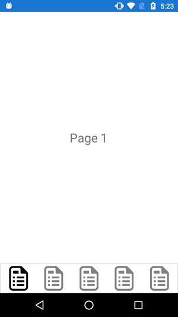
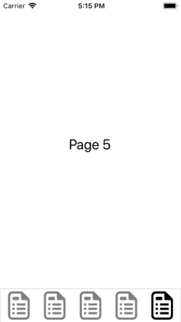

# xamarin-forms-bottom-navigationbar
This repository helps to design bottom tabbed page in xamarin forms and also works in MVVM architecture

# Introduction
This is repository is not designed by tabbed-page. It is created view of botton navigation bar view using content-view and added that code in content page where we have required to disply bottom navigation bar. This repository is created in xamarin-forms and also supports MVVM architecture.

# Android-screenshot

# iOS-screenshot

# How it's implemented?
First, create view that contains design of bottom navigation bar. 
Here, you can bind images or text as per your requiremnet dynemically.
Here, code is written in UserControls > BottomNavigationBarView.xaml file.

See the sample code as below :

       ...
         <Grid BackgroundColor="White">
                <StackLayout  x:Name="stckIconPage1" Orientation="Vertical" Grid.Column="0" HorizontalOptions="Fill" VerticalOptions="End">
                    <Image  Source="{Binding IconPage1}" HeightRequest="50" />
                </StackLayout>

                <StackLayout x:Name="stckIconPage2"  Orientation="Vertical" Grid.Column="1"  HorizontalOptions="Fill" VerticalOptions="End">
                    <Image Source="{Binding IconPage2}" HeightRequest="50"  />
                </StackLayout>

                <StackLayout x:Name="stckIconPage3" Orientation="Vertical"  Grid.Column="2"  HorizontalOptions="Fill" VerticalOptions="End">
                    <Image  Source="{Binding IconPage3}" HeightRequest="50" />
                </StackLayout>

                <StackLayout  x:Name="stckIconPage4" Orientation="Vertical"  Grid.Column="3"  HorizontalOptions="Fill" VerticalOptions="End">
                    <Image Source="{Binding IconPage4}" HeightRequest="50" />
                </StackLayout>

                <StackLayout x:Name="stckIconPage5" Orientation="Vertical" Grid.Column="4"  HorizontalOptions="Fill" VerticalOptions="End">
                    <Image  Source="{Binding IconPage5}" HeightRequest="50"   />
                </StackLayout>
          </Grid>
        ...
        
  After, you have to add code in code behind for bottom bar image click events. This is achieved by GestureRecognizers in OnBindingContextChanged event. 
  
  Here, code is written in UserControls > BottomNavigationBarView.xaml.cs file.
  
      ...
        protected override void OnBindingContextChanged()
        {
            base.OnBindingContextChanged();
            stckIconPage1.GestureRecognizers.Add(new TapGestureRecognizer
            {
                Command = new Command(_ =>
                {
                    Application.Current.MainPage = new Views.Page1();
                })
            });
            
            ...
            // add code for all pages that you have to perform click event.
        }
     ...

Then, create ViewModel for this menu view which will bind the image and also contains the logic for set active image. You can see code in BottomNavigationBarViewModel.cs.

Now, it's time to display bottom navigation bar in ContentPage. Add one grid and give name to that grid. It will bind view from code behind in default constructor.

Here, code is written in Page1.xaml file.

     ...
        <StackLayout BackgroundColor="LightGray" Padding="1" Grid.Row="1" VerticalOptions="End">
            <Frame Padding="4" HorizontalOptions="FillAndExpand" HasShadow="False" BackgroundColor="White" CornerRadius="0">
                <Grid VerticalOptions="End" x:Name="GridFooter"/>
            </Frame>
        </StackLayout>
     ...
     
 In code behind, add one line which binds the view and also set the active image for selected page. Add code as below:
 
 Here, code is written in Page1.xaml.cs file in default constroctor.
       GridFooter.Children.Add(new UserControls.BottomNavigationBarView(Constants.MenuConst.MenuPage1));
       
 Now, build and run your project. You can see the bottom navigation bar in device. It will work same for android and iOS devices. You can also modify the code for see navigation bar as per you requirement and also add animations.
 
 
